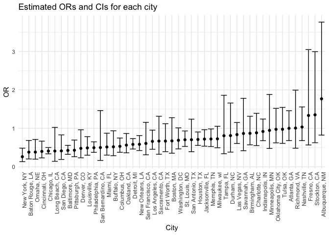
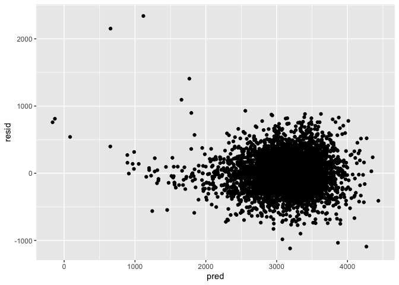
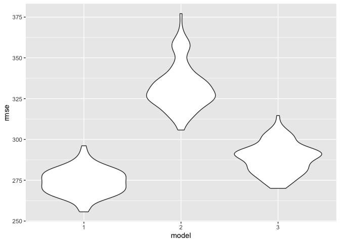

p8105_hw6_jl6521
================
Jiayi
2024-11-27

## Problem 2

1.  data cleaning

``` r
url = "https://raw.githubusercontent.com/washingtonpost/data-homicides/master/homicide-data.csv"
homicide_data = read_csv(url) %>% 
  janitor::clean_names() %>% 
  mutate(
    city_state = str_c(city,", ",state),
    solved_status = ifelse(disposition == "Closed by arrest", 1, 0),
    victim_age = as.numeric(victim_age)) %>% 
  filter(
    !city_state %in% c("Dallas, TX","Phoenix, AZ", "Kansas City, MO","Tulsa, AL"),
    victim_race %in% c("White", "Black")
    ) 
```

    ## Rows: 52179 Columns: 12
    ## ── Column specification ────────────────────────────────────────────────────────
    ## Delimiter: ","
    ## chr (9): uid, victim_last, victim_first, victim_race, victim_age, victim_sex...
    ## dbl (3): reported_date, lat, lon
    ## 
    ## ℹ Use `spec()` to retrieve the full column specification for this data.
    ## ℹ Specify the column types or set `show_col_types = FALSE` to quiet this message.

    ## Warning: There was 1 warning in `mutate()`.
    ## ℹ In argument: `victim_age = as.numeric(victim_age)`.
    ## Caused by warning:
    ## ! NAs introduced by coercion

2.  logistic regression for Baltimore, MD

``` r
baltimore_df = 
  homicide_data %>%  
  filter(city_state == "Baltimore, MD") 
  
fit_logistic = 
  glm(solved_status ~ victim_age + victim_race + victim_sex, data = baltimore_df, family = binomial()) %>% 
  broom::tidy(conf.int = TRUE, conf.level = 0.95)

odds_ratio = fit_logistic %>%
  mutate(
    OR = exp(estimate),
    CI_low = exp(conf.low),
    CI_high = exp(conf.high)
  ) %>% 
  filter(term == "victim_sexMale") %>% 
  select(OR, CI_low, CI_high, p.value) %>%  
  knitr::kable(digits = 3)
```

3.  glm for each of the cities

``` r
logistic_results <- homicide_data %>%
  group_by(city_state) %>%
  nest() %>%
  mutate(
    fit = map(data, ~ glm(solved_status ~ victim_age + victim_race + victim_sex, data = ., family = binomial())),
    results = map(fit, ~ broom::tidy(.x, conf.int = TRUE, conf.level = 0.95) %>%
      filter(term == "victim_sexMale") %>%
        mutate(
          OR = exp(estimate),
          CI_low = exp(conf.low),
          CI_high = exp(conf.high)
        ) %>% 
      select(OR, CI_low, CI_high, p.value))
  ) %>%
  unnest(results) %>% 
  select(OR, CI_low, CI_high, p.value)
```

    ## Warning: There were 44 warnings in `mutate()`.
    ## The first warning was:
    ## ℹ In argument: `results = map(...)`.
    ## ℹ In group 1: `city_state = "Albuquerque, NM"`.
    ## Caused by warning:
    ## ! glm.fit: fitted probabilities numerically 0 or 1 occurred
    ## ℹ Run `dplyr::last_dplyr_warnings()` to see the 43 remaining warnings.

    ## Adding missing grouping variables: `city_state`

``` r
logistic_results%>%
  knitr::kable(digits = 3)
```

| city_state         |    OR | CI_low | CI_high | p.value |
|:-------------------|------:|-------:|--------:|--------:|
| Albuquerque, NM    | 1.767 |  0.825 |   3.762 |   0.139 |
| Atlanta, GA        | 1.000 |  0.680 |   1.458 |   1.000 |
| Baltimore, MD      | 0.426 |  0.324 |   0.558 |   0.000 |
| Baton Rouge, LA    | 0.381 |  0.204 |   0.684 |   0.002 |
| Birmingham, AL     | 0.870 |  0.571 |   1.314 |   0.511 |
| Boston, MA         | 0.674 |  0.353 |   1.277 |   0.226 |
| Buffalo, NY        | 0.521 |  0.288 |   0.936 |   0.029 |
| Charlotte, NC      | 0.884 |  0.551 |   1.391 |   0.600 |
| Chicago, IL        | 0.410 |  0.336 |   0.501 |   0.000 |
| Cincinnati, OH     | 0.400 |  0.231 |   0.667 |   0.001 |
| Columbus, OH       | 0.532 |  0.377 |   0.748 |   0.000 |
| Denver, CO         | 0.479 |  0.233 |   0.962 |   0.041 |
| Detroit, MI        | 0.582 |  0.462 |   0.734 |   0.000 |
| Durham, NC         | 0.812 |  0.382 |   1.658 |   0.576 |
| Fort Worth, TX     | 0.669 |  0.394 |   1.121 |   0.131 |
| Fresno, CA         | 1.335 |  0.567 |   3.048 |   0.496 |
| Houston, TX        | 0.711 |  0.557 |   0.906 |   0.006 |
| Indianapolis, IN   | 0.919 |  0.678 |   1.241 |   0.582 |
| Jacksonville, FL   | 0.720 |  0.536 |   0.965 |   0.028 |
| Las Vegas, NV      | 0.837 |  0.606 |   1.151 |   0.278 |
| Long Beach, CA     | 0.410 |  0.143 |   1.024 |   0.072 |
| Los Angeles, CA    | 0.662 |  0.457 |   0.954 |   0.028 |
| Louisville, KY     | 0.491 |  0.301 |   0.784 |   0.003 |
| Memphis, TN        | 0.723 |  0.526 |   0.984 |   0.042 |
| Miami, FL          | 0.515 |  0.304 |   0.873 |   0.013 |
| Milwaukee, wI      | 0.727 |  0.495 |   1.054 |   0.098 |
| Minneapolis, MN    | 0.947 |  0.476 |   1.881 |   0.876 |
| Nashville, TN      | 1.034 |  0.681 |   1.556 |   0.873 |
| New Orleans, LA    | 0.585 |  0.422 |   0.812 |   0.001 |
| New York, NY       | 0.262 |  0.133 |   0.485 |   0.000 |
| Oakland, CA        | 0.563 |  0.364 |   0.867 |   0.009 |
| Oklahoma City, OK  | 0.974 |  0.623 |   1.520 |   0.908 |
| Omaha, NE          | 0.382 |  0.199 |   0.711 |   0.003 |
| Philadelphia, PA   | 0.496 |  0.376 |   0.650 |   0.000 |
| Pittsburgh, PA     | 0.431 |  0.263 |   0.696 |   0.001 |
| Richmond, VA       | 1.006 |  0.483 |   1.994 |   0.987 |
| San Antonio, TX    | 0.705 |  0.393 |   1.238 |   0.230 |
| Sacramento, CA     | 0.669 |  0.326 |   1.314 |   0.255 |
| Savannah, GA       | 0.867 |  0.419 |   1.780 |   0.697 |
| San Bernardino, CA | 0.500 |  0.166 |   1.462 |   0.206 |
| San Diego, CA      | 0.413 |  0.191 |   0.830 |   0.017 |
| San Francisco, CA  | 0.608 |  0.312 |   1.155 |   0.134 |
| St. Louis, MO      | 0.703 |  0.530 |   0.932 |   0.014 |
| Stockton, CA       | 1.352 |  0.626 |   2.994 |   0.447 |
| Tampa, FL          | 0.808 |  0.340 |   1.860 |   0.619 |
| Tulsa, OK          | 0.976 |  0.609 |   1.544 |   0.917 |
| Washington, DC     | 0.690 |  0.465 |   1.012 |   0.061 |

4.  Plot that shows the estimated ORs and CIs for each city

``` r
logistic_results %>% 
  ggplot(aes(x=reorder(city_state, OR), y = OR))+
  geom_point()+
  geom_errorbar(aes(ymin = CI_low, ymax = CI_high))+
  labs(
    title = "Estimated ORs and CIs for each city", 
    x = "City", 
    y = "OR"
  )+
  theme_minimal()+
  theme(axis.text.x=element_text(angle = 90, hjust =1))
```

<!-- -->
Comment: The plot shows the odds ratio and confidence interval of
solving homicides comparing male victims to female victims. From the
plot we can see that CI for many cities crosses 1, showing that there
are no differences between male and female victims. Albuquerque, NM has
the highest odds ratio of male victims vs female victim and New York, NY
has the lowest odds ratio.

## Problem 3

1.  data cleaning

``` r
birthweight = 
  read_csv("./data/birthweight.csv", show_col_types = FALSE) %>%
  janitor::clean_names() %>%
  mutate(
    babysex = factor(babysex, levels = c(1, 2), labels = c("Male", "Female")),
    frace = factor(frace, levels = c(1, 2, 3, 4, 8, 9), labels = c("White", "Black", "Asian", "Puerto Rican", "Other", "Unknown")),
    malform = factor(malform, levels = c(0, 1), labels = c("Absent", "Present")),
    mrace = factor(mrace, levels = c(1, 2, 3, 4, 8), labels = c("White", "Black", "Asian", "Puerto Rican", "Other")),
  parity = as.integer(parity),
    pnumlbw = as.integer(pnumlbw),
    pnumsga = as.integer(pnumsga))

colSums(is.na(birthweight))
```

    ##  babysex    bhead  blength      bwt    delwt  fincome    frace  gaweeks 
    ##        0        0        0        0        0        0        0        0 
    ##  malform menarche  mheight   momage    mrace   parity  pnumlbw  pnumsga 
    ##        0        0        0        0        0        0        0        0 
    ##    ppbmi     ppwt   smoken   wtgain 
    ##        0        0        0        0

Comment: I cleaned the variable names, and convert some categorical
variables from numeric to factor and ensure some variables be integers.
I also label those levels into real meaning rather than numbers. There
are no missing values.

2.  Regression model for birth weight

``` r
regression_model = lm(bwt ~ babysex + bhead + blength + delwt + fincome + frace + gaweeks + malform + menarche + mheight + momage + mrace + parity + pnumlbw + pnumsga + ppbmi + ppwt + smoken + wtgain, data = birthweight)

summary(regression_model)
```

    ## 
    ## Call:
    ## lm(formula = bwt ~ babysex + bhead + blength + delwt + fincome + 
    ##     frace + gaweeks + malform + menarche + mheight + momage + 
    ##     mrace + parity + pnumlbw + pnumsga + ppbmi + ppwt + smoken + 
    ##     wtgain, data = birthweight)
    ## 
    ## Residuals:
    ##      Min       1Q   Median       3Q      Max 
    ## -1097.68  -184.86    -3.33   173.09  2344.15 
    ## 
    ## Coefficients: (3 not defined because of singularities)
    ##                     Estimate Std. Error t value Pr(>|t|)    
    ## (Intercept)       -6265.3914   660.4011  -9.487  < 2e-16 ***
    ## babysexFemale        28.7073     8.4652   3.391 0.000702 ***
    ## bhead               130.7781     3.4523  37.881  < 2e-16 ***
    ## blength              74.9536     2.0217  37.075  < 2e-16 ***
    ## delwt                 4.1007     0.3948  10.386  < 2e-16 ***
    ## fincome               0.2898     0.1795   1.614 0.106551    
    ## fraceBlack           14.3313    46.1501   0.311 0.756168    
    ## fraceAsian           21.2361    69.2960   0.306 0.759273    
    ## fracePuerto Rican   -46.9962    44.6782  -1.052 0.292912    
    ## fraceOther            4.2969    74.0741   0.058 0.953745    
    ## gaweeks              11.5494     1.4654   7.882 4.06e-15 ***
    ## malformPresent        9.7650    70.6259   0.138 0.890039    
    ## menarche             -3.5508     2.8951  -1.226 0.220083    
    ## mheight               9.7874    10.3116   0.949 0.342588    
    ## momage                0.7593     1.2221   0.621 0.534418    
    ## mraceBlack         -151.4354    46.0453  -3.289 0.001014 ** 
    ## mraceAsian          -91.3866    71.9190  -1.271 0.203908    
    ## mracePuerto Rican   -56.4787    45.1369  -1.251 0.210901    
    ## parity               95.5411    40.4793   2.360 0.018307 *  
    ## pnumlbw                   NA         NA      NA       NA    
    ## pnumsga                   NA         NA      NA       NA    
    ## ppbmi                 4.3538    14.8913   0.292 0.770017    
    ## ppwt                 -3.4716     2.6121  -1.329 0.183913    
    ## smoken               -4.8544     0.5871  -8.269  < 2e-16 ***
    ## wtgain                    NA         NA      NA       NA    
    ## ---
    ## Signif. codes:  0 '***' 0.001 '**' 0.01 '*' 0.05 '.' 0.1 ' ' 1
    ## 
    ## Residual standard error: 272.5 on 4320 degrees of freedom
    ## Multiple R-squared:  0.7183, Adjusted R-squared:  0.717 
    ## F-statistic: 524.6 on 21 and 4320 DF,  p-value: < 2.2e-16

``` r
model_1 = lm(bwt ~ babysex + bhead + blength + delwt + gaweeks + mrace + parity + smoken, data = birthweight)

fit_1 = model_1 
#%>% 
   broom::tidy() 
```

    ## # A tibble: 0 × 0

``` r
diagnostic_1 = birthweight %>%
  modelr::add_predictions(fit_1) %>% 
  modelr::add_residuals(fit_1)
```

Modeling process: I think all these variables may be related to baby’s
birth weight. Baby’s physical conditions: either being a boy or a girl
and head circumference may be associated with the weight. Mother’s
features such as weight, height, age at delivery, pre-pregnancy BMI and
weight may affect the baby’s weight. The socioeconomic status (family’s
monthly income) may influence the diet the mom can have, which affects
baby’s weight. Gestational age may be related to the time the mother
gives birth, which could link to the baby’s weight.There may be some
associations between mother and father’s race with baby’s weight,
determined by gene. Presence of malformations may affect weight. The
number of cigarettes smoked may affect the health of baby, which
influences the weight. Therefore, I run linear regression with all the
variables first.

Next, I found that baby’s sex, baby’s head circumference at birth,
baby’s length at birth, mother’s weight at delivery, gestational age in
weeks, mother’s race, number of live births prior to this pregnancy, and
average number of cigarettes smoked per day during pregnancy are
significant. Therefore I put those in my final model.

3.  Plot of residuals against fitted values

``` r
ggplot(data = diagnostic_1, aes(x = pred, y = resid))+
  geom_point()
```

<!-- -->

4.  Comparison of models

``` r
model_2 = lm(bwt ~ blength + gaweeks, data = birthweight)
model_3 = lm(bwt ~ bhead*blength*babysex, data = birthweight)

cv_df <- crossv_mc(birthweight, 100) %>% 
  mutate(
    train = map(train, as_tibble),
    test = map(test, as_tibble)
  )

cv_df = 
  cv_df %>%  
  mutate(
    model_1  = map(train, \(df) lm(bwt ~ babysex + bhead + blength + delwt + gaweeks + mrace + parity + smoken, data = df)),
    model_2  = map(train, \(df) lm(bwt ~ blength + gaweeks, data = df)),
    model_3  = map(train, \(df) lm(bwt ~ bhead*blength*babysex, data = df)),
    rmse_1 =  map2_dbl(model_1, test, \(mod, df) rmse(model = mod, data = df)),
    rmse_2 = map2_dbl(model_2, test, \(mod, df) rmse(model = mod, data = df)),
    rmse_3 = map2_dbl(model_3, test, \(mod, df) rmse(model = mod, data = df)))
```

    ## Warning: There was 1 warning in `mutate()`.
    ## ℹ In argument: `rmse_1 = map2_dbl(model_1, test, function(mod, df) rmse(model =
    ##   mod, data = df))`.
    ## Caused by warning in `predict.lm()`:
    ## ! prediction from rank-deficient fit; attr(*, "non-estim") has doubtful cases

``` r
library(tidyverse)
```

    ## ── Attaching core tidyverse packages ──────────────────────── tidyverse 2.0.0 ──
    ## ✔ forcats   1.0.0     ✔ tibble    3.2.1
    ## ✔ lubridate 1.9.3     
    ## ── Conflicts ────────────────────────────────────────── tidyverse_conflicts() ──
    ## ✖ modelr::bootstrap() masks broom::bootstrap()
    ## ✖ nlme::collapse()    masks dplyr::collapse()
    ## ✖ dplyr::filter()     masks stats::filter()
    ## ✖ dplyr::lag()        masks stats::lag()
    ## ℹ Use the conflicted package (<http://conflicted.r-lib.org/>) to force all conflicts to become errors

``` r
cv_df %>%  
  select(starts_with("rmse")) %>%  
  pivot_longer(
    everything(),
    names_to = "model", 
    values_to = "rmse",
    names_prefix = "rmse_") %>%  
  mutate(model = fct_inorder(model)) %>%  
  ggplot(aes(x = model, y = rmse)) + geom_violin()
```

<!-- -->
Comment: The figure shows the RMSE for each of the three models based on
100 cross-validation iterations. The model I chose (model 1) has the
lowest RMSE score, indicating a good predictive power, and a narrow
distribution, showing a good stability. Model 2, with factors of length
at birth and gestational age, has the highest RMSE and wide variability,
showing clearly the poorest performance. The model 3 ranks in the
middle. Therefore, Model 1 may be the best choice.
