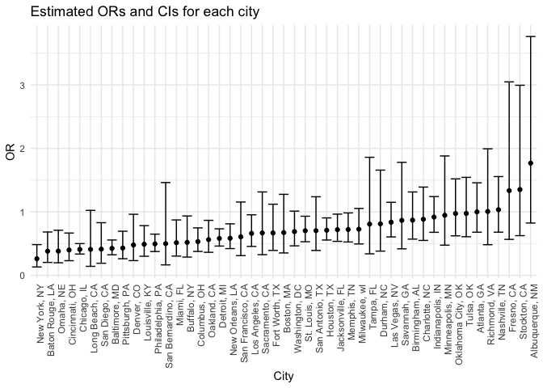

p8105_hw6_jl6521
================
Jiayi
2024-11-27

## Problem 1

## Problem 2

1.  data cleaning

``` r
url = "https://raw.githubusercontent.com/washingtonpost/data-homicides/master/homicide-data.csv"
homicide_data = read_csv(url) %>% 
  janitor::clean_names() %>% 
  mutate(
    city_state = str_c(city,", ",state),
    solved_status = ifelse(disposition == "Closed by arrest", 1, 0),
    victim_age = as.numeric(victim_age)) %>% 
  filter(
    !city_state %in% c("Dallas, TX","Phoenix, AZ", "Kansas City, MO","Tulsa, AL"),
    victim_race %in% c("White", "Black")
    ) 
```

    ## Rows: 52179 Columns: 12
    ## ── Column specification ────────────────────────────────────────────────────────
    ## Delimiter: ","
    ## chr (9): uid, victim_last, victim_first, victim_race, victim_age, victim_sex...
    ## dbl (3): reported_date, lat, lon
    ## 
    ## ℹ Use `spec()` to retrieve the full column specification for this data.
    ## ℹ Specify the column types or set `show_col_types = FALSE` to quiet this message.

    ## Warning: There was 1 warning in `mutate()`.
    ## ℹ In argument: `victim_age = as.numeric(victim_age)`.
    ## Caused by warning:
    ## ! NAs introduced by coercion

2.  logistic regression for Baltimore, MD

``` r
baltimore_df = 
  homicide_data %>%  
  filter(city_state == "Baltimore, MD") 
  
fit_logistic = 
  glm(solved_status ~ victim_age + victim_race + victim_sex, data = baltimore_df, family = binomial()) %>% 
  broom::tidy(conf.int = TRUE, conf.level = 0.95)

odds_ratio = fit_logistic %>% 
  select(term, estimate, conf.low, conf.high, p.value) %>%  
  filter(term == "victim_sexMale") %>% 
  knitr::kable(digits = 3)
```

3.  glm for each of the cities

``` r
logistic_results <- homicide_data %>%
  group_by(city_state) %>%
  nest() %>%
  mutate(
    fit = map(data, ~ glm(solved_status ~ victim_age + victim_race + victim_sex, data = ., family = binomial())),
    results = map(fit, ~ broom::tidy(.x, conf.int = TRUE, conf.level = 0.95) %>%
      filter(term == "victim_sexMale") %>%
      select(term, estimate, conf.low, conf.high, p.value))
  ) %>%
  unnest(results) %>% 
  select(city_state, term, estimate, conf.low, conf.high, p.value)
```

    ## Warning: There were 44 warnings in `mutate()`.
    ## The first warning was:
    ## ℹ In argument: `results = map(...)`.
    ## ℹ In group 1: `city_state = "Albuquerque, NM"`.
    ## Caused by warning:
    ## ! glm.fit: fitted probabilities numerically 0 or 1 occurred
    ## ℹ Run `dplyr::last_dplyr_warnings()` to see the 43 remaining warnings.

``` r
logistic_results%>%
  knitr::kable(digits = 3)
```

| city_state         | term           | estimate | conf.low | conf.high | p.value |
|:-------------------|:---------------|---------:|---------:|----------:|--------:|
| Albuquerque, NM    | victim_sexMale |    0.570 |   -0.193 |     1.325 |   0.139 |
| Atlanta, GA        | victim_sexMale |    0.000 |   -0.385 |     0.377 |   1.000 |
| Baltimore, MD      | victim_sexMale |   -0.854 |   -1.126 |    -0.584 |   0.000 |
| Baton Rouge, LA    | victim_sexMale |   -0.964 |   -1.588 |    -0.380 |   0.002 |
| Birmingham, AL     | victim_sexMale |   -0.139 |   -0.560 |     0.273 |   0.511 |
| Boston, MA         | victim_sexMale |   -0.395 |   -1.040 |     0.244 |   0.226 |
| Buffalo, NY        | victim_sexMale |   -0.653 |   -1.243 |    -0.066 |   0.029 |
| Charlotte, NC      | victim_sexMale |   -0.123 |   -0.596 |     0.330 |   0.600 |
| Chicago, IL        | victim_sexMale |   -0.891 |   -1.090 |    -0.691 |   0.000 |
| Cincinnati, OH     | victim_sexMale |   -0.917 |   -1.464 |    -0.405 |   0.001 |
| Columbus, OH       | victim_sexMale |   -0.630 |   -0.975 |    -0.290 |   0.000 |
| Denver, CO         | victim_sexMale |   -0.736 |   -1.458 |    -0.038 |   0.041 |
| Detroit, MI        | victim_sexMale |   -0.541 |   -0.772 |    -0.310 |   0.000 |
| Durham, NC         | victim_sexMale |   -0.208 |   -0.961 |     0.506 |   0.576 |
| Fort Worth, TX     | victim_sexMale |   -0.402 |   -0.933 |     0.114 |   0.131 |
| Fresno, CA         | victim_sexMale |    0.289 |   -0.567 |     1.114 |   0.496 |
| Houston, TX        | victim_sexMale |   -0.341 |   -0.585 |    -0.099 |   0.006 |
| Indianapolis, IN   | victim_sexMale |   -0.085 |   -0.388 |     0.216 |   0.582 |
| Jacksonville, FL   | victim_sexMale |   -0.329 |   -0.624 |    -0.036 |   0.028 |
| Las Vegas, NV      | victim_sexMale |   -0.178 |   -0.501 |     0.141 |   0.278 |
| Long Beach, CA     | victim_sexMale |   -0.891 |   -1.947 |     0.024 |   0.072 |
| Los Angeles, CA    | victim_sexMale |   -0.413 |   -0.784 |    -0.047 |   0.028 |
| Louisville, KY     | victim_sexMale |   -0.712 |   -1.199 |    -0.244 |   0.003 |
| Memphis, TN        | victim_sexMale |   -0.324 |   -0.642 |    -0.017 |   0.042 |
| Miami, FL          | victim_sexMale |   -0.663 |   -1.191 |    -0.135 |   0.013 |
| Milwaukee, wI      | victim_sexMale |   -0.319 |   -0.703 |     0.053 |   0.098 |
| Minneapolis, MN    | victim_sexMale |   -0.054 |   -0.743 |     0.632 |   0.876 |
| Nashville, TN      | victim_sexMale |    0.034 |   -0.385 |     0.442 |   0.873 |
| New Orleans, LA    | victim_sexMale |   -0.536 |   -0.863 |    -0.208 |   0.001 |
| New York, NY       | victim_sexMale |   -1.338 |   -2.019 |    -0.724 |   0.000 |
| Oakland, CA        | victim_sexMale |   -0.574 |   -1.011 |    -0.143 |   0.009 |
| Oklahoma City, OK  | victim_sexMale |   -0.026 |   -0.473 |     0.419 |   0.908 |
| Omaha, NE          | victim_sexMale |   -0.961 |   -1.615 |    -0.341 |   0.003 |
| Philadelphia, PA   | victim_sexMale |   -0.701 |   -0.978 |    -0.431 |   0.000 |
| Pittsburgh, PA     | victim_sexMale |   -0.842 |   -1.337 |    -0.363 |   0.001 |
| Richmond, VA       | victim_sexMale |    0.006 |   -0.727 |     0.690 |   0.987 |
| San Antonio, TX    | victim_sexMale |   -0.350 |   -0.934 |     0.214 |   0.230 |
| Sacramento, CA     | victim_sexMale |   -0.402 |   -1.120 |     0.273 |   0.255 |
| Savannah, GA       | victim_sexMale |   -0.143 |   -0.871 |     0.577 |   0.697 |
| San Bernardino, CA | victim_sexMale |   -0.692 |   -1.799 |     0.380 |   0.206 |
| San Diego, CA      | victim_sexMale |   -0.884 |   -1.654 |    -0.186 |   0.017 |
| San Francisco, CA  | victim_sexMale |   -0.498 |   -1.166 |     0.144 |   0.134 |
| St. Louis, MO      | victim_sexMale |   -0.352 |   -0.635 |    -0.071 |   0.014 |
| Stockton, CA       | victim_sexMale |    0.301 |   -0.469 |     1.097 |   0.447 |
| Tampa, FL          | victim_sexMale |   -0.214 |   -1.080 |     0.621 |   0.619 |
| Tulsa, OK          | victim_sexMale |   -0.025 |   -0.496 |     0.434 |   0.917 |
| Washington, DC     | victim_sexMale |   -0.371 |   -0.765 |     0.012 |   0.061 |

4.  Plot that shows the estimated ORs and CIs for each city

``` r
logistic_results %>% 
  mutate(OR = exp(estimate),conf.low=exp(conf.low),conf.high = exp(conf.high)) %>% 
  ggplot(aes(x=reorder(city_state, OR), y = OR))+
  geom_point()+
  geom_errorbar(aes(ymin = conf.low, ymax = conf.high))+
  labs(
    title = "Estimated ORs and CIs for each city", 
    x = "City", 
    y = "OR"
  )+
  theme_minimal()+
  theme(axis.text.x=element_text(angle = 90, hjust =1))
```

<!-- -->
Comment: The plot shows the odds ratio and confidence interval of
solving homicides comparing male victims to female victims. From the
plot we can see that CI for many cities crosses 1, showing that there
are no differences between male and female victims. Albuquerque, NM has
the highest odds ratio of male victims vs female victim and New York, NY
has the lowest odds ratio.
